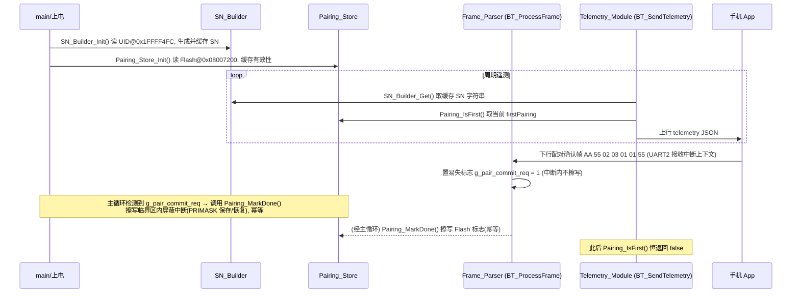

# Design Document

## Overview

本设计针对 N32G003 走步机/律动机裸机固件（工程根 `BX39v2.0_32`），实现蓝牙协议 V2.1（定稿 r2）本期范围的两件事：

1. **基于芯片 96 位唯一 ID（UID）生成机器序列号 SN**，替换 `myapp/bt_transparent.c` 中硬编码的 `TELEM_SN "T2-20260315-000123"`，使每台设备的 `sn` 出厂即全局唯一、稳定可重现。
2. **`firstPairing` 的 Flash 持久化与配对确认寄存器 `0x03` 的处理**，将 `firstPairing` 从 RF315 遥控器配对状态（`re_pairing_done`）解耦，改为基于独立 Flash 标志判定。

设计在不破坏现有运行控制（寄存器 `0x00`）、调速（寄存器 `0x01`）与坏帧丢弃行为的前提下，新增两个内聚模块（`SN_Builder`、`Pairing_Store`），并对下行解析（`BT_ProcessFrame`）与遥测构建（`BT_SendTelemetry`）做最小侵入式改造。

### 关键事实核对（基于源码确认）

设计前已核对以下事实，作为后续实现的硬约束：

- **UID 地址与长度**：`CMSIS/device/n32g003.h` 第 460–461 行定义 `#define UID_BASE ((uint32_t)0x1FFFF4FC)` 与 `#define UID_LENGTH ((uint32_t)0x0C)`（12 字节 = 96 位）。本设计直接复用这两个宏，**不另行硬编码地址**。
- **Flash 容量与可擦写范围**：`CMSIS/device/n32g003_flash.ld` 定义 `FLASH : ORIGIN = 0x8000000, LENGTH = 0x7600`（29.5K），即有效地址 `0x08000000`–`0x080075FF`。`FLASH_One_Page_Erase`（`src/n32g003_std_periph_driver/src/n32g003_flash.c`）仅接受 `0x08000000 ≤ page_address ≤ 0x080075FF` 的页地址，页大小 512 字节（`0x200`）。
- **现有 Flash 数据布局**：`myapp/addr_store.c` / `addr_store.h` 将遥控器配对地址存于页 `0x08007400`（即末页 `0x08007400`–`0x080075FF`），magic 为 `0xA5A50000`，仅写入该页起始处 1 个字（`0xA5A5HHLL`）。**`Pairing_Store` 必须使用与之不重叠的独立页，避免擦写互相破坏。**
- **Flash 驱动接口**：`FLASH_Unlock()` / `FLASH_Lock()` / `FLASH_One_Page_Erase(addr)` / `FLASH_Word_Program(addr, data)`，擦/写返回 `FLASH_STS`，成功值为 `FLASH_EOP`（见 `n32g003_flash.h` 第 69 行枚举）。
- **Flash 驱动不屏蔽中断（关键并发约束）**：`src/n32g003_std_periph_driver/src/n32g003_flash.c` 中 `FLASH_One_Page_Erase()` 与 `FLASH_Word_Program()` **内部不屏蔽中断**，仅通过 `FLASH_Last_Operation_Wait()` 轮询忙标志等待完成；擦除/编程为毫秒级操作，期间 CPU 仍从同一片 Flash 取指。
- **无 RWW（读写不能同时）保障，由调用方负责**：该芯片擦/写期间不提供"读写分离"硬件保障。因此必须由调用方保证：任一时刻只有一个 Flash 擦/写操作在进行；且擦写临界区内应尽量减少从 Flash 取指的并发活动（即减少擦写期间执行的中断服务程序）。
- **`SYS_RUN_Process` 的真实执行上下文（更正既往误述）**：`src/n32g003_it.c` 的 `TIM1_BRK_UP_TRG_COM_IRQHandler`（TIM1 5KHz / 1ms tick 中断，NVIC 优先级 1）中依次调用 `RCV315_Process()` 与 `SYS_RUN_Process()`。即 `SYS_RUN_Process` 运行在 **TIM1 中断上下文**，**不是主循环**（项目 `readme.md` 亦记载"5KHz ISR：…SYS_RUN_Process"，可佐证）。
- **现有 `AddrStore_Save` 的真实执行上下文（更正既往误述）**：`myapp/SYS_RUN.c` 中 `AddrStore_Save(...)` 在 `SYS_RUN_Process` 的 `if (re_pairing) { ... }` 配对分支内被调用，因此既有的遥控器地址 Flash 擦写实际发生在 **TIM1 中断上下文**，且仅在开机配对窗口（`re_pairing == 1`）期间发生；开机配对结束（`RCV315_ExitPairing`）后该路径不再触发。该既有擦写**未做任何中断屏蔽保护**。
- **遥测缓冲**：`BT_SendTelemetry` 使用 `char buf[TELEM_BUF_SIZE]`（`TELEM_BUF_SIZE = 512`）经 `sprintf` 构建后由 `UART2_SendString` 上行。
- **现有 firstPairing 逻辑（待替换）**：当前用函数内 `static uint8_t s_first_pair = 1;`，并在 `re_pairing_done` 置位时置 0——这是与 RF315 错误耦合的根因。

## Architecture

### 模块划分

```
┌──────────────────────────────────────────────────────────────┐
│                         应用初始化 (main)                       │
│   上电 → SN_Builder_Init() → Pairing_Store_Init() → 主循环      │
└───────────────┬──────────────────────────────┬────────────────┘
                │                                │
        ┌───────▼────────┐              ┌────────▼─────────┐
        │  SN_Builder    │              │  Pairing_Store   │
        │ (sn_builder.c) │              │ (pairing_store.c)│
        │  读 UID → SN   │              │  Flash 配对标志   │
        └───────┬────────┘              └───┬──────────┬───┘
                │ 提供 SN 字符串              │ 判定/置位 │
                │                            │          │
        ┌───────▼────────────────────────────▼──────┐   │
        │      Telemetry_Module (BT_SendTelemetry)   │   │
        │  sn ← SN_Builder, firstPairing ← Pairing   │   │
        └────────────────────────────────────────────┘   │
                                                          │ MarkDone
        ┌──────────────────────────────────────────────┐ │
        │   Frame_Parser (BT_ProcessFrame, bt_transparent│◄┘
        │   .c) 新增 reg=0x03 / data=0x01 分支            │
        └────────────────────────────────────────────────┘
```

### 设计决策与理由

1. **新增独立源文件 `myapp/sn_builder.c` / `sn_builder.h` 与 `myapp/pairing_store.c` / `pairing_store.h`**（建议方案）。
   - 理由：两者职责单一、可独立验证；`bt_transparent.c` 当前已较大且混合 UART 驱动、帧解析、遥测构建三类职责，再塞入 UID/Flash 逻辑会进一步降低可维护性。独立文件也便于在 Keil MDK / IAR EWARM 工程中按文件粒度管理，且与既有 `addr_store.c`（同样是独立的小型持久化模块）风格一致。
   - 备选（并入 `bt_transparent.c`）被否决：增加耦合，不利于后续协议迭代时单独替换。

2. **`Pairing_Store` 使用专用 Flash 页 `0x08007200`**（与 `addr_store` 的 `0x08007400` 页物理隔离）。
   - 理由：N32G003 擦除以 512 字节整页为单位。若与 `addr_store` 共页，任一方擦写都会清掉另一方数据。`0x08007200` 是 `0x08007400` 之前的相邻整页（`0x08007200`–`0x080073FF`），512 字节对齐（`0x7200 / 0x200 = 57`，整除），且 `≤ 0x080075FF` 满足 `FLASH_One_Page_Erase` 的地址校验。两页互不重叠，任一模块擦写不影响另一模块。
   - 注：当前固件代码段从 `0x08000000` 起，`addr_store` 既已占用末页 `0x08007400`，说明程序映像未触及该区；`0x08007200` 位于其下方，正常构建不会与代码段冲突。实现时应在链接产物里复核代码末尾地址 `_etext` 远小于 `0x08007200`（见 Testing Strategy 验证点）。

3. **SN 在上电时一次性计算并缓存为静态字符串**，遥测时直接引用。
   - 理由：UID 只读且恒定，无需每条遥测重复转换；满足"稳定可重现、不引入随机/时间因子"的要求（需求 2）。

4. **`firstPairing` 判定每次遥测时实时读取 Flash 标志**（而非仅上电缓存）。
   - 理由：配对确认帧可能在运行期到达并立即持久化，下一条遥测须反映最新值（需求 5.2）。Flash 读取是单次内存映射读，开销极低。

### 初始化与运行时序



## Components and Interfaces

### 1. SN_Builder（`myapp/sn_builder.h` / `sn_builder.c`）

负责读取 UID 并生成 SN 字符串，结果缓存于模块静态缓冲区。

```c
/* sn_builder.h */
#ifndef __SN_BUILDER_H__
#define __SN_BUILDER_H__

#include "main.h"

/* model("PF-T2")=5 + '-'=1 + 24 hex + '\0'=1 = 31 字节，满足需求 1.4 (≤31) */
#define SN_BUF_SIZE   32   /* 预留对齐余量，实际占用 31 字节 */

/* 上电初始化：读取 UID@UID_BASE 的 12 字节，生成并缓存 SN 字符串。
 * 必须在首次 BT_SendTelemetry 之前调用一次。 */
void SN_Builder_Init(void);

/* 返回缓存的 SN 字符串（以 '\0' 结尾，长度 ≤ 30 字符）。
 * 在 SN_Builder_Init 之前调用返回空字符串 ""。 */
const char *SN_Builder_Get(void);

#endif
```

行为规格：

- `SN_Builder_Init()`：
  - 以 `UID_BASE`（`0x1FFFF4FC`）为起点，按地址从低到高读取 `UID_LENGTH`（12）字节。读取方式为 3 次 32 位读或 12 次字节读；为避免端序歧义，**按字节地址顺序逐字节处理**（需求 1.1、1.2）。
  - 对每个字节，先输出高半字节再输出低半字节，映射到大写十六进制字符表 `"0123456789ABCDEF"`，共 24 字符（需求 1.2）。
  - 在 SN 缓冲区写入 `TELEM_MODEL`（`"PF-T2"`）+ `'-'` + 24 字符 hex + `'\0'`，总长 30 字符 + 终止符 = 31 字节（需求 1.3、1.4）。
  - **兜底**：UID 全 `0xFF` 或全 `0x00` 时不做特殊跳变——hex 转换天然产出确定性字符串（`FFFFFFFFFFFFFFFFFFFFFFFF` 或 `000000000000000000000000`），SN 仍为合法非空字符串（需求 2.3）。即"全 0xFF/0x00"无需额外分支，转换逻辑本身已满足；设计上仅在注释中标注此为已知可接受输出，不替换为伪造值（保持可重现性，需求 2.2）。
- `SN_Builder_Get()`：返回静态缓冲区指针，纯读、可重入安全（无写操作）。

模型前缀来源：复用现有宏 `TELEM_MODEL "PF-T2"`，将其从 `bt_transparent.c` 提升为可被 `sn_builder.c` 共享（在 `sn_builder.c` 内重定义同值常量，或将 `TELEM_MODEL` 移入公共头）。设计采用：`sn_builder.c` 内部定义 `#define SN_MODEL_PREFIX "PF-T2"`，与 `TELEM_MODEL` 同值，避免跨文件耦合；`model` 字段仍由 `bt_transparent.c` 的 `TELEM_MODEL` 输出，二者取值一致（需求 3.3）。

### 2. Pairing_Store（`myapp/pairing_store.h` / `pairing_store.c`）

负责 `firstPairing` 标志的 Flash 持久化、判定与幂等置位。

```c
/* pairing_store.h */
#ifndef __PAIRING_STORE_H__
#define __PAIRING_STORE_H__

#include "main.h"

/* 专用页，与 addr_store 的 0x08007400 物理隔离，避免整页擦除互相破坏 */
#define PAIR_FLASH_PAGE   ((uint32_t)0x08007200)
/* 已配对登记标志的 magic（区别于 addr_store 的 0xA5A50000） */
#define PAIR_DONE_MAGIC   ((uint32_t)0xA5A50003)

/* 上电初始化：读取 Flash 标志并缓存有效性。建议主循环遥测前调用一次。 */
void Pairing_Store_Init(void);

/* 返回当前 firstPairing 判定：
 *   Flash 无有效标志(未编程 0xFFFFFFFF) → 1 (true，首次配对)
 *   Flash 有有效标志(== PAIR_DONE_MAGIC) → 0 (false，已登记) */
uint8_t Pairing_IsFirst(void);

/* 持久化"已完成配对登记"：将 PAIR_DONE_MAGIC 写入 Flash。
 * 幂等：若已为有效标志则直接返回，不重复擦写。 */
void Pairing_MarkDone(void);

#endif
```

行为规格：

- `Pairing_Store_Init()`：读取 `*(__IO uint32_t*)PAIR_FLASH_PAGE`，与 `PAIR_DONE_MAGIC` 比较，缓存布尔结果（可选缓存以减少重复读；判定仍可每次直接读 Flash）。
- `Pairing_IsFirst()`：返回 `(*(__IO uint32_t*)PAIR_FLASH_PAGE == PAIR_DONE_MAGIC) ? 0 : 1`。未编程页读出 `0xFFFFFFFF ≠ magic` → 返回 1（需求 4.1、4.2、4.3）。
- `Pairing_MarkDone()`：
  - **幂等判定（在屏蔽中断之前完成，以缩短临界区）**：先读 Flash 比对 magic，若已 `== PAIR_DONE_MAGIC`，立即返回，**不擦写**（幂等，需求 5.3）。绝大多数情况下该路径直接命中，临界区根本不触发。
  - 否则进入**擦写临界区，全程屏蔽中断**：用保存/恢复 `PRIMASK` 的标准做法保护 `FLASH_One_Page_Erase` + `FLASH_Word_Program` 这段擦写过程：
    ```c
    uint32_t primask = __get_PRIMASK();   /* 保存当前中断使能状态 */
    __disable_irq();                      /* 进入临界区：屏蔽所有可屏蔽中断 */
    FLASH_Unlock();
    if (FLASH_One_Page_Erase(PAIR_FLASH_PAGE) == FLASH_EOP) {
        FLASH_Word_Program(PAIR_FLASH_PAGE, PAIR_DONE_MAGIC); /* 仅擦除成功才编程 */
    }
    FLASH_Lock();
    __set_PRIMASK(primask);               /* 退出临界区：恢复原中断状态 */
    ```
    - `FLASH_Unlock()`/`FLASH_Lock()` 可置于临界区内（如上）或紧邻临界区；幂等判定（读 Flash 比对 magic）在屏蔽中断前完成以缩短临界区时长。
  - **屏蔽中断的理由**：芯片 Flash 驱动擦/写期间不屏蔽中断且无 RWW 保障（见"关键事实核对"）。屏蔽中断可彻底杜绝两类风险：(a) 与 TIM1 中断路径中 `AddrStore_Save` 的**嵌套 Flash 操作**；(b) 擦写期间 ISR 仍从同一片 Flash 取指造成的取指冲突/抖动。这是市面主流的标准解法。
  - **副作用（明确接受）**：擦写期间（约数毫秒）TIM1 1ms tick 中断被挂起，`g_ms_tick` 会少计若干拍、轻微滞后，属业界标准代价且可接受；又因幂等判定使该临界区在绝大多数情况下根本不触发，实际影响极小。
  - 擦/写失败（非 `FLASH_EOP`）时不写入，标志保持无效，下次遥测仍报 `true`（见 Error Handling）。

### 3. Frame_Parser 改造（`myapp/bt_transparent.c` → `BT_ProcessFrame`）

在现有 `bt_cmd == 0x02` 分支内，新增对寄存器 `0x03`、数据 `0x01` 的处理，且必须置于现有 `0x00`/`0x01` 处理逻辑之外、互不干扰。

改造点（伪代码，标注插入位置）：

```c
static void BT_ProcessFrame(void)
{
    uint8_t i;
    uint8_t speed_val;

    if (bt_cmd == 0x02) {
        /* —— 新增：配对确认寄存器 0x03 ——
         * 命中条件：写帧覆盖到 reg 0x03，且对应数据字节为 0x01 */
        if (bt_reg <= 3 && (bt_reg + bt_len) > 3) {
            uint8_t pair_val = bt_buf[3 - bt_reg];
            if (pair_val == 0x01) {
                Pairing_MarkDone();      /* 幂等持久化，需求 5.1/5.3 */
            }
            /* pair_val != 0x01 → 不改变标志，需求 5.4；
             * 同时不写入 g_bt_regs 的运行/调速语义，直接返回避免误触发 */
            return;
        }

        /* —— 既有逻辑保持不变 —— */
        if (bt_reg <= 1 && (bt_reg + bt_len) > 1) { /* 速度校验... */ }
        for (i = 0; i < bt_len && (bt_reg + i) < BT_REGS_SIZE; i++) {
            g_bt_regs[bt_reg + i] = bt_buf[i];
        }
        if (bt_reg <= 1 && (bt_reg + bt_len) > 1) { RCV315_SetSpeed(...); }
        if (bt_reg == 0 && bt_len > 0) { BT_HandleRunCtrl(g_bt_regs[0]); }
    } else if (bt_cmd == 0x03) {
        BT_SendFrame(0x03, bt_reg, bt_len, &g_bt_regs[bt_reg]);
    }
}
```

设计要点：

- 命中条件用 `bt_reg <= 3 && (bt_reg + bt_len) > 3` 判断"本帧数据是否覆盖寄存器 3"，与现有速度寄存器（reg 1）的命中风格一致。对协议规定的标准帧 `AA 55 02 03 01 01 55`（`reg=0x03, len=0x01, data=0x01`）成立。
- 命中 0x03 后**直接 `return`**，不进入既有 `g_bt_regs` 写入与运行控制路径，确保不触发任何状态机切换或调速（需求 7.2）。
- 帧头/读写字节/帧尾的合法性由既有状态机 `BT_ParseByte` 把关：非 `AA 55` / 非 `02|03` / 无 `0x55` 帧尾的帧不会进入 `BT_ProcessFrame`，坏帧丢弃行为不变，不写 Pairing_Flag（需求 7.3）。
- reg 为 `0x03` 但数据非 `0x01`：进入分支但不调用 `Pairing_MarkDone()`，标志不变（需求 5.4）。

### 4. Telemetry_Module 改造（`myapp/bt_transparent.c` → `BT_SendTelemetry`）

- 移除 `#define TELEM_SN "T2-20260315-000123"`（需求 3.2）。
- 移除函数内 `static uint8_t s_first_pair` 及 `extern uint8_t re_pairing_done;` 相关代码块（解耦 RF315，需求 6.1、6.2）。
- `sprintf` 的 `sn` 实参由 `TELEM_SN` 改为 `SN_Builder_Get()`（需求 3.1）。
- `firstPairing` 实参由 `s_first_pair ? "true" : "false"` 改为 `Pairing_IsFirst() ? "true" : "false"`（需求 4.4）。
- `model`、`productionDate` 及 JSON 其余结构保持不变（需求 3.3）。

改造后实参片段：

```c
...
TELEM_MODEL,                                  /* model 不变 */
SN_Builder_Get(),                             /* sn ← 动态 UID */
TELEM_PROD_DATE,                              /* productionDate 不变 */
Pairing_IsFirst() ? "true" : "false"          /* firstPairing ← Flash */
```

## Data Models

### UID（只读，芯片固化）

| 字段 | 地址 | 长度 | 说明 |
|------|------|------|------|
| UID | `UID_BASE = 0x1FFFF4FC` | `UID_LENGTH = 0x0C`（12 字节 / 96 位） | 出厂烧录、不可更改的全局唯一标识 |

### SN 字符串（运行期缓存）

```
布局：[ "PF-T2" ][ '-' ][ 24 个大写 hex 字符 ][ '\0' ]
长度： 5         1       24                    1     = 31 字节
示例： PF-T2-A1B2C3D4E5F6A7B8C9D0E1F2
```

- hex 顺序：UID 字节地址低→高；每字节高半字节字符在前、低半字节在后。
- 缓冲区：`char g_sn[SN_BUF_SIZE]`，`SN_BUF_SIZE = 32`（实际占用 31 字节，满足需求 1.4 的 ≤31）。

### Pairing_Flag（Flash 持久化，1 个字）

| 项 | 值 | 含义 |
|----|----|------|
| 存储页 | `PAIR_FLASH_PAGE = 0x08007200` | 专用页，与 `addr_store`（`0x08007400`）物理隔离 |
| 有效标志 | `PAIR_DONE_MAGIC = 0xA5A50003` | 写入即表示"已完成 App 配对登记"，`firstPairing = false` |
| 未编程 | `0xFFFFFFFF` | 出厂/恢复出厂态，`firstPairing = true` |

### Flash 地址布局总览

```
0x08000000 ┬ .isr_vector / .text / .rodata / .data(LMA)  (程序映像)
           │            ...（_etext 应远小于 0x08007200）...
0x08007200 ┼ Pairing_Store 专用页 (512B)  ← 本期新增, 仅用首字
0x08007400 ┼ addr_store 遥控器地址页 (512B) ← 既有, 仅用首字
0x080075FF ┘ Flash 末地址 (LENGTH=0x7600)
```

两个数据页相邻但不重叠，整页擦除互不影响。

## Error Handling

| 场景 | 处理策略 | 对应需求 |
|------|----------|----------|
| UID 全 `0xFF`（不可用） | 不特殊处理，hex 转换产出 `FFFFFFFF...`，SN 为合法非空字符串 `PF-T2-FFFFFFFFFFFFFFFFFFFFFFFF` | 2.3 |
| UID 全 `0x00` | 同上，产出 `PF-T2-000000000000000000000000`，合法非空 | 2.3 |
| Flash 擦除失败（`FLASH_One_Page_Erase != FLASH_EOP`） | 不执行写入，`Pairing_MarkDone` 静默返回；标志保持无效，下条遥测仍报 `firstPairing=true`；App 可重发配对确认帧重试 | 5.1 |
| Flash 写入失败（`FLASH_Word_Program != FLASH_EOP`） | 同上，标志保持无效；保证不产生半写脏数据（magic 校验天然过滤未完整写入的字） | 4.3、5.1 |
| 重复收到配对确认帧 | `Pairing_MarkDone` 先判定再决定是否擦写，已有效则直接返回，避免无谓擦写损耗 Flash 寿命 | 5.3 |
| reg=0x03 但 data≠0x01 | 不调用 `Pairing_MarkDone`，标志不变 | 5.4 |
| 配对确认帧与遥测并发（UART2 接收中断置标志、主循环擦写、TIM1 中断遥测/计时） | `Pairing_IsFirst()` 为单次 32 位对齐读，原子；`Pairing_MarkDone()` 由主循环在屏蔽中断的临界区内擦写（PRIMASK 保存/恢复），擦写期间无任何 ISR 介入；遥测读到的要么是旧值要么是新值，均为一致状态，无中间态 | 4.5、5.2 |
| 与既有 `AddrStore_Save` 的 Flash 嵌套风险 | 既有 `AddrStore_Save` 在 TIM1 中断里擦写且无保护，仅因其只在开机配对窗口（`re_pairing==1`）触发、与 App 配对确认帧时间不重叠，实际碰撞概率极低；本设计通过 `Pairing_MarkDone` 的中断屏蔽临界区，把这一残余风险也彻底消除 | 4.5、5.2 |
| 坏帧（帧头/读写字节/帧尾不合法） | 由 `BT_ParseByte` 状态机在进入 `BT_ProcessFrame` 前丢弃，不写 Flash | 7.3 |

### 并发与执行上下文说明（重要）

`BT_ParseByte` → `BT_ProcessFrame` 运行在 UART2 接收中断上下文（`UARTz_IRQHandler`）。`Pairing_MarkDone()` 内含 Flash 擦写，耗时毫秒级，且芯片 Flash 驱动擦/写期间**不屏蔽中断、无 RWW 保障**，期间 CPU 仍从同一片 Flash 取指（见"关键事实核对"）。

需要特别澄清既往误述：本工程的 `SYS_RUN_Process` 与其中的现有 `AddrStore_Save` 擦写**并非在主循环执行**，而是运行在 **TIM1（5KHz / 1ms tick，NVIC 优先级 1）中断上下文**，且仅在开机配对窗口（`re_pairing==1`）期间发生。换言之，系统中已经存在"在中断里做无保护 Flash 擦写"的既有行为。

基于此，本设计的并发处理按市面主流做法确定：

- **采用方案 A（中断置标志 + 主循环擦写）**：`BT_ProcessFrame` 命中 reg=0x03 / data=0x01 时，仅置易失标志 `volatile uint8_t g_pair_commit_req = 1`，**不在 UART2 接收中断里擦写**；主循环（`main` 的 while 循环）检测到该标志后调用 `Pairing_MarkDone()` 并清标志。
  - **真实理由（不再宣称"与既有主循环模式一致"）**：避免在 UART2 接收中断里执行毫秒级 Flash 擦写，从而阻塞 1ms tick（TIM1 中断）及其他中断；把擦写集中到主循环这一单一上下文，便于在其外再加临界区保护、也便于推理与维护。
- **新增临界区保护（主流标准解法）**：`Pairing_MarkDone()` 的 `FLASH_One_Page_Erase` + `FLASH_Word_Program` 擦写段，用保存/恢复 `PRIMASK` 的方式屏蔽中断（CMSIS：`__get_PRIMASK()` 保存、`__disable_irq()` 进入、`__set_PRIMASK(saved)` 退出）。
  - 目的：彻底杜绝与 TIM1 中断路径中 `AddrStore_Save` 的嵌套 Flash 操作，并避免擦写期间任何 ISR 从 Flash 取指造成的取指冲突/抖动。
  - 副作用并接受：擦写期间（约数毫秒）TIM1 1ms tick 被挂起，`g_ms_tick` 轻微滞后、少计若干拍，属可接受的业界标准代价；幂等判定（已写则直接返回不擦写）使该临界区在绝大多数情况下根本不触发。
  - 临界区收尾：`FLASH_Unlock()`/`FLASH_Lock()` 可放在临界区内或紧邻；幂等判定（读 Flash 比对 magic）在屏蔽中断前完成以缩短临界区。

**残余风险与可选加固**：现有 `AddrStore_Save` 仍在 TIM1 中断里无保护擦写，但其只在开机配对窗口触发、与 App 配对确认帧时间不重叠，碰撞概率极低；本设计的 `Pairing_MarkDone` 临界区已消除本期新增路径的并发风险。作为**本期范围外的健壮性建议（不强制）**：未来可给 `AddrStore_Save` 也加同样的 PRIMASK 临界区，使所有 Flash 擦写路径都具备一致的中断屏蔽保护。

- **方案 B（直接在中断中擦写）被否决**：实现虽简单，但会在 UART2 接收中断里长时间擦写、显著延长中断时长并阻塞 TIM1 tick，且更难加临界区保护，不符合主流做法。

## Testing Strategy

本工程为 Keil MDK-ARM / IAR EWARM 裸机 C 工程，**无标准单元测试框架，亦无主机侧测试运行环境**。本期改造涉及的逻辑要么依赖芯片只读 UID、要么依赖片上 Flash 擦写与 UART 上行——均为硬件/外设绑定行为，无法在主机侧以纯函数方式驱动。因此本设计**不采用属性测试（PBT）与单元测试**，验证手段为"**编译通过 + 串口实测上行 JSON 字段 + 下行帧实测**"。

> 关于 PBT 适用性的判断：唯一接近纯函数的逻辑是"UID 字节 → 24 位 hex"的转换，理论上可做 round-trip 属性测试；但本工程无测试框架、无法引入主机构建链，且该转换极小、可由串口观测直接覆盖。故本设计省略 Correctness Properties 章节，改以可观测验证点保证正确性。

### 验证手段一：编译/链接

- VP-1：工程在 Keil MDK-ARM 下完整编译链接通过，新增 `sn_builder.c`、`pairing_store.c` 已加入工程文件列表，无未定义符号、无警告升级为错误。
- VP-2：检查链接 map 文件，确认代码段末尾 `_etext`（或 ROM 使用上界）远低于 `0x08007200`，证明 `Pairing_Store` 专用页未与程序映像重叠。

### 验证手段二：串口实测上行 JSON（Telemetry）

用串口助手抓取 telemetry 报文，逐字段核对：

- VP-3（需求 1、2、3）：`manufacturerData.sn` 形如 `PF-T2-` + 24 位大写 hex，长度 30 字符；同一台设备多次上电 `sn` 完全一致；不同设备 `sn` 不同。
- VP-4（需求 2.3 兜底）：在可构造的样片上（或调试器强制读到全 `0xFF`/`0x00` 的模拟）确认 `sn` 仍为合法非空字符串（`PF-T2-FFFF...` / `PF-T2-0000...`）。
- VP-5（需求 3.2）：报文中不再出现 `T2-20260315-000123`。
- VP-6（需求 3.3）：`model`=`PF-T2`、`productionDate`=`20260315`、JSON 结构与字段顺序与改造前一致。
- VP-7（需求 3.4）：抓取最坏情况报文（各数值字段取最大宽度），实测整条 JSON（不含结尾 `\r\n`）字节数 ≤ 480。

### 验证手段三：firstPairing 持久化与配对确认帧（下行）

- VP-8（需求 4.1、4.4）：出厂/擦除 `0x08007200` 页后上电，telemetry `firstPairing` 报 `true`。
- VP-9（需求 5.1、5.2）：下发 `AA 55 02 03 01 01 55`，其后所有 telemetry `firstPairing` 报 `false`。
- VP-10（需求 4.5、5.5）：断电重新上电，`firstPairing` 仍为 `false`（Flash 恢复一致）。
- VP-11（需求 5.3 幂等）：重复下发配对确认帧多次，借调试器观察 `0x08007200` 仅被擦写一次（或加临时计数确认 `Pairing_MarkDone` 命中已有效分支后不擦写）。
- VP-12（需求 5.4）：下发 reg=0x03 但 data≠0x01（如 `AA 55 02 03 01 00 55`），`firstPairing` 不变。
- VP-13（需求 6.1、6.2）：触发 RF315 遥控器无线配对（`re_pairing_done` 置位）后，telemetry `firstPairing` 不受影响（仍由 Flash 标志决定）。

### 验证手段四：回归（既有控制路径不受影响）

- VP-14（需求 7.1）：下发 reg=0x00 运行控制帧与 reg=0x01 调速帧，运行/调速行为与改造前一致。
- VP-15（需求 7.2）：下发配对确认帧（reg=0x03）时，设备不发生任何状态机切换、不调速。
- VP-16（需求 7.3）：下发破坏帧头/读写字节/帧尾的非法帧，设备维持坏帧丢弃，`0x08007200` 页不被写入。

### 验证手段五：Flash 隔离

- VP-17：先完成遥控器配对（写 `addr_store` 的 `0x08007400`），再下发 App 配对确认帧（写 `0x08007200`），用调试器读两页，确认两者数据并存、互不破坏；反向顺序同样验证。
- VP-18（并发/临界区，需求 4.5、5.2）：用调试器/逻辑分析仪确认 `Pairing_MarkDone()` 擦写期间中断被屏蔽（`PRIMASK` 在临界区内为 1、退出后恢复），且该擦写不与 TIM1 中断里的 `AddrStore_Save` 并发发生；可观测到擦写期间 1ms tick 短暂挂起、`g_ms_tick` 轻微滞后但功能正常。
