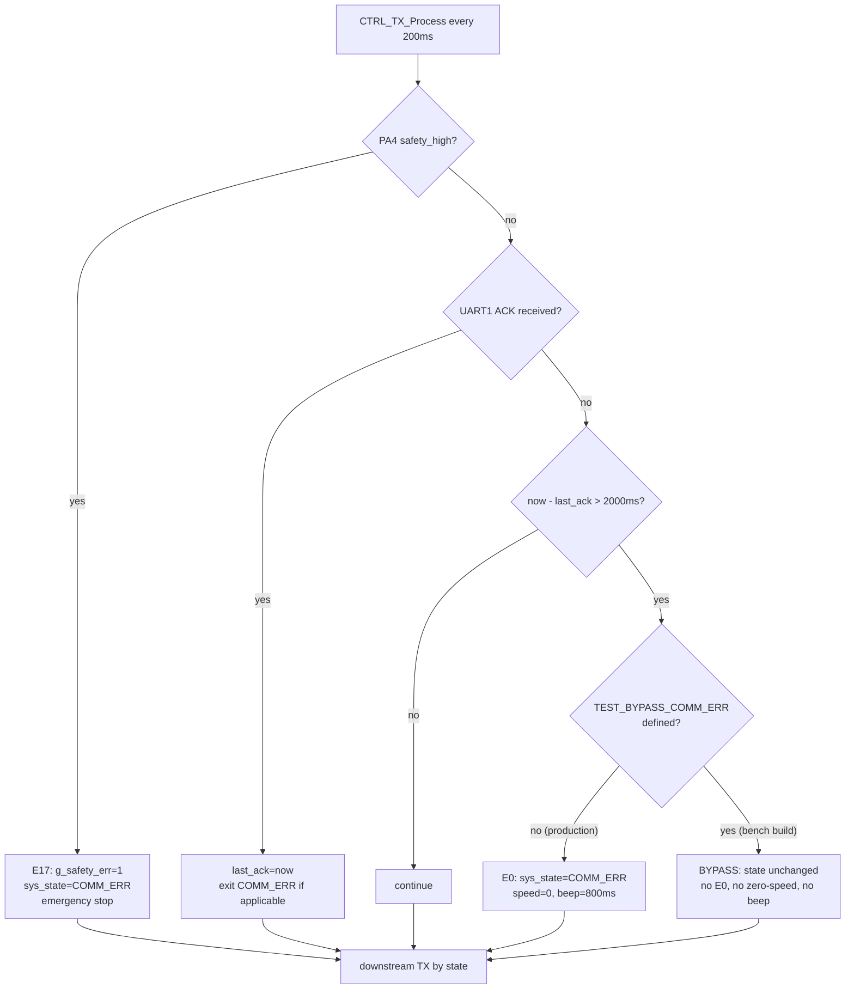
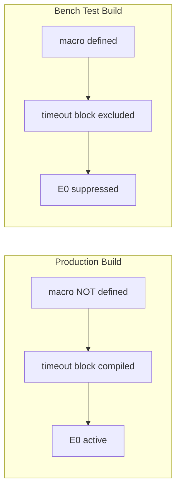

# Design Document

## Overview

This design adds a compile-time gated bench-testing bypass that suppresses the **E0**
communication-timeout error in the BX39 treadmill firmware (Nations N32G003 MCU). The bypass
lets the Bluetooth (UART2) command path be exercised on the bench without the downstream motor
controller board connected on UART1.

The change is deliberately minimal. In production firmware the only place the E0 condition is
raised is a single `if` block inside `CTRL_TX_Process()` in `myapp/ctrl_tx.c`:

```c
/* 通信超时 → COMM_ERR (2s 无应答) */
if (sys_state != SYS_STATE_COMM_ERR && (now - last_ack > 2000)) {
    sys_state = SYS_STATE_COMM_ERR;   /* → E0 (g_safety_err stays 0) */
    RCV315_SetSpeed(0.0f);            /* zeroes speed              */
    Beep_Tem = 800;                   /* 800 ms COMM_ERR beep      */
}
```

Because this is the sole entry point into `SYS_STATE_COMM_ERR` for the timeout case (the
safety-clip path sets `g_safety_err = 1` before entering the same state, and the display
renders "E0" only when `g_safety_err == 0`), guarding this one block behind a compile-time
macro is sufficient to satisfy every acceptance criterion:

- Suppressing the block keeps `sys_state` unchanged, so the firmware never renders **E0**,
  never forces speed to zero on account of the timeout, and never emits the 800 ms beep
  (Requirement 2).
- The safety-clip (**E17**) block earlier in the same function is untouched, so PA4 detection
  still transitions to `COMM_ERR` with `g_safety_err = 1` (Requirement 3).
- The overheat (**E2**) path lives in `SYS_RUN_Process()` / `SYS_RUN_EnterState()` in
  `myapp/SYS_RUN.c` and is untouched (Requirement 4).
- With the firmware kept out of `COMM_ERR`, the `BT_Matrix()` command gate in
  `myapp/bt_transparent.c` no longer rejects commands due to the error state, so the Bluetooth
  command path behaves normally (Requirement 5).
- When the macro is undefined the block compiles exactly as today, so production behavior is
  byte-for-byte unchanged (Requirement 6).

**Key design decision:** Use a single `#ifndef` guard around the existing timeout block rather
than refactoring the watchdog into a new decision function. This keeps the diff to a few lines,
guarantees the production path is literally the current code, and makes the change trivially
revertible by deleting the macro definition (Requirement 1).

## Architecture

### Where the bypass sits in the control flow

`CTRL_TX_Process()` is called every main-loop iteration and does real work every
`CTRL_PERIOD_MS` (200 ms). Its watchdog section runs three independent checks in order:
safety-clip (E17), ACK-received (clears/exits COMM_ERR), and ACK-timeout (E0). Only the third
check is gated.



Only node **F → H** is new. Nodes **B/C** (E17) and the overheat path in `SYS_RUN` are
outside this guard and therefore unaffected.

### Build-configuration architecture

The `TEST_BYPASS_COMM_ERR` macro is a build-level switch, not a runtime variable. Two build
configurations are defined:



The macro is surfaced in a single, discoverable location so that enabling/disabling the bypass
is a one-line action and code review can confirm production is unaffected. See
[Compile-Time Flag Placement](#compile-time-flag-placement).

## Components and Interfaces

### Affected components

| Component | File | Change |
|-----------|------|--------|
| Control_Transmit_Module | `myapp/ctrl_tx.c` | Wrap the ACK-timeout block in `#ifndef TEST_BYPASS_COMM_ERR` |
| Build configuration | `myapp/ctrl_tx.c` (top of file) and/or MDK/EWARM project defines | Define/undefine `TEST_BYPASS_COMM_ERR` |
| Display_Module | `myapp/SYS_RUN.c` | **No source change** — E0 branch is simply never reached under bypass |
| Bluetooth_Command_Path | `myapp/bt_transparent.c`, `SYS_RUN_HandleBTCtrl()` | **No source change** — benefits automatically from not being in COMM_ERR |

### Compile-Time Flag Placement

The macro is controlled in one place. Two equivalent mechanisms are supported; the design
recommends the first for reviewability and the second for CI/build-matrix use:

1. **In-source default (recommended for clarity).** A commented-out definition at the top of
   `myapp/ctrl_tx.c`, immediately after the includes:

   ```c
   /* Bench-testing bypass for the E0 (UART1 ACK timeout) path.
    * DEFINE for bench/test builds only. Leave undefined for production.
    * See .kiro/specs/e0-bypass-bt-testing. */
   /* #define TEST_BYPASS_COMM_ERR */
   ```

   A bench tester uncomments this one line; a release build leaves it commented.

2. **Project-level define (recommended for build matrices).** Add `TEST_BYPASS_COMM_ERR` to the
   preprocessor-defines of a dedicated "BenchTest" build target in the MDK-ARM (`.uvprojx`)
   and/or EWARM (`.ewp`) project, leaving the production target's defines unchanged.

Both mechanisms resolve to the same guarded code. No other file needs to define or check the
macro (Requirement 1.1, 1.4).

### Interface: `CTRL_TX_Process()`

The function signature, call site (`main()` loop), period (200 ms), and all other behavior are
unchanged. The only modification is that the timeout branch is conditionally compiled:

```c
    /* 通信超时 → COMM_ERR (2s 无应答) */
#ifndef TEST_BYPASS_COMM_ERR
    if (sys_state != SYS_STATE_COMM_ERR && (now - last_ack > 2000)) {
        sys_state = SYS_STATE_COMM_ERR;
        RCV315_SetSpeed(0.0f);
        Beep_Tem = 800;
    }
#else
    /* TEST_BYPASS_COMM_ERR: E0 (UART1 ACK timeout) suppressed for bench testing.
     * State is left unchanged so the Bluetooth command path can be exercised
     * without the downstream motor controller connected. E17 (PA4) and E2
     * (overheat/ESTOP) paths remain fully active. `last_ack` continues to be
     * maintained by the ACK-received branch above, so no other logic changes. */
#endif
```

Notes:
- `last_ack`, `ack_inited`, and the downstream-TX `switch` are outside the guard and behave
  identically. Under bypass the state simply never becomes `COMM_ERR` via timeout, so the
  `switch` continues to send speed/vibration/idle frames as dictated by the real state instead
  of `UART1_SendEmergencyStop()`.
- No `#include` changes are required; the macro is a bare preprocessor symbol.

### Interfaces that require no change (and why)

- **`SYS_RUN_UpdateDisplay()`** renders "E0" only inside `case SYS_STATE_COMM_ERR` when
  `g_safety_err == 0`. Under bypass the timeout never sets `COMM_ERR`, so this branch is
  unreachable and "E0" is never displayed (Requirement 2.3). The "E17" branch
  (`g_safety_err == 1`) and the "E2" case (`SYS_STATE_ESTOP`) are untouched (Requirements 3.2,
  4.2).
- **`BT_Matrix()` / `BT_DispatchControl()` / `SYS_RUN_HandleBTCtrl()`** reject commands when
  `sys_state == SYS_STATE_COMM_ERR`. Keeping the firmware out of that state under bypass means
  speed/mode/start/stop commands are accepted and processed by the same matrix logic as
  production (Requirement 5.1, 5.2). The thermal cooling gate (`BT_ThermalNotNormal()`) and the
  `SYS_STATE_ESTOP` handling remain fully intact.

## Data Models

This feature introduces no new runtime data structures. It relies on existing global state and
one new preprocessor symbol.

### Preprocessor symbol

| Symbol | Type | Domain | Meaning |
|--------|------|--------|---------|
| `TEST_BYPASS_COMM_ERR` | compile-time macro | defined / undefined | Defined → Bench_Test_Build (E0 suppressed). Undefined → Production_Build (E0 active). |

### Existing state referenced (unchanged)

| Symbol | File | Role in this feature |
|--------|------|----------------------|
| `sys_state` (`uint8_t`, values from `SYS_State_t`) | `SYS_RUN.c` | The guarded block is the only timeout writer of `SYS_STATE_COMM_ERR` (=8). |
| `g_safety_err` (`uint8_t`) | `ctrl_tx.c` | 0 → E0 render, 1 → E17 render. Set only by the (ungated) safety-clip block. |
| `last_ack` (`uint32_t`, static) | `ctrl_tx.c` | Timestamp of last UART1 ACK; still maintained under bypass. |
| `Beep_Tem` (`uint16_t`) | `SYS_RUN.c` | 800 ms COMM_ERR beep; not written by the timeout path under bypass. |

### State-transition model (timeout path)

| Build | Precondition | Event | Resulting `sys_state` | E0 shown | Speed forced 0 | 800 ms beep |
|-------|--------------|-------|----------------------|----------|----------------|-------------|
| Production | not `COMM_ERR` | `now - last_ack > 2000` | `COMM_ERR` (E0) | yes | yes | yes |
| Bench (bypass) | any non-error state | `now - last_ack > 2000` | unchanged | no | no | no |
| Either | PA4 high | safety-clip | `COMM_ERR` (E17) | no (E17) | yes | yes |
| Either | temp > 130 °C for 10 s | overheat | `ESTOP` (E2) | no (E2) | yes | yes (long) |

## Error Handling

- **Preserved safety errors.** The E17 (safety-clip / PA4) and E2 (overheat / ESTOP) paths are
  outside the guarded block and are never disabled by any build configuration. This is enforced
  structurally: the `#ifndef` wraps only the UART1-timeout `if` statement, and both other paths
  live in code that the macro does not touch (Requirements 3, 4).
- **No new error states.** The bypass removes an error transition; it never adds one. Under
  bypass the firmware simply remains in its normal operating state when UART1 is silent.
- **Downstream commands under bypass.** With the firmware out of `COMM_ERR`, the CTRL_TX
  `switch` sends normal state-appropriate frames on UART1. On the bench there is no listener, so
  these transmits are harmless. When a motor controller *is* connected and responding, the
  ACK-received branch keeps `last_ack` fresh and the timeout condition never fires regardless of
  the macro, so a bench build connected to real hardware still operates (though bench builds are
  not intended for shipping).
- **Revertibility.** Removing the macro definition (or building the production target) restores
  the exact original object code for `CTRL_TX_Process()`. Because production is compiled with the
  block present and no other file references the macro, there is no residual behavior to clean up
  (Requirement 1.3, 6).

## Testing Strategy

### PBT applicability assessment

Property-based testing is **not appropriate** for this feature, and the design intentionally
omits a Correctness Properties section. Reasons:

- The change is a **compile-time configuration guard** around a single `if` statement. Its
  effect is selected at build time, not by input variation, so there is no meaningful
  "for all inputs X, property P(X) holds" statement to exercise.
- The behavior being verified is a small, finite decision table (a handful of discrete
  `sys_state` values × macro defined/undefined × PA4 high/low). This is exhaustively covered by
  a few example/table cases; running 100 randomized iterations would not reveal additional bugs.
- The relevant logic is tightly coupled to hardware (GPIO PA4 reads, UART1 ACK, `g_ms_tick`
  timing) with no existing host test harness, and the requirements explicitly call for a
  minimal, trivially-revertible change rather than a refactor into pure, host-testable
  functions.

Per the workflow guidance (config validation, side-effect-only, and simple finite-state changes
are not PBT candidates), verification uses **compile-gating checks, example/table-based
state-transition tests, and on-target bench integration tests**.

### 1. Build-configuration verification (SMOKE)

Verifies Requirement 1 and the compile-time gating itself.

- **Production build compiles unchanged.** Build the production target (macro undefined) and
  confirm it succeeds and that `CTRL_TX_Process()` still contains the timeout block (diff the
  preprocessed output or the map/listing against the pre-change baseline).
- **Bench build compiles.** Build with `TEST_BYPASS_COMM_ERR` defined (via the BenchTest target
  or the uncommented in-source `#define`) and confirm it succeeds.
- **Single-symbol confinement.** Grep the tree to confirm `TEST_BYPASS_COMM_ERR` is referenced
  only where intended (`myapp/ctrl_tx.c` guard, plus its definition site), demonstrating all
  bypass logic is confined to conditionally-compiled sections (Requirement 1.4).

### 2. State-transition example tests (EXAMPLE / EDGE_CASE)

These validate the decision table above. If a host build of the module logic is available (mocking
`GPIO_Input_Pin_Data_Get`, `UART1_CheckAndClearAck`, `UART1_GetTemp`, `RCV315_*`, `g_ms_tick`),
implement them as unit tests; otherwise they are executed as scripted on-target checks (Section 4).

Production build (macro undefined):
- **E0 raised on timeout.** Start in a non-error state, hold the mocked ACK false, advance
  `g_ms_tick` past 2000 ms, run `CTRL_TX_Process()` → `sys_state == SYS_STATE_COMM_ERR`,
  `g_safety_err == 0`, speed forced to 0, `Beep_Tem == 800`, display renders "E0"
  (Requirements 6.1, 6.2, 6.3).

Bench build (macro defined):
- **E0 suppressed on timeout.** Same stimulus → `sys_state` unchanged (not `COMM_ERR`), display
  does not render "E0", speed not forced to 0 by the timeout, no 800 ms COMM_ERR beep
  (Requirements 2.1, 2.3, 2.4, 2.5).
- **E0 suppressed indefinitely.** Repeat the timeout stimulus over many cycles with ACK always
  false → firmware never enters `COMM_ERR` via timeout (Requirement 2.2).
- **E17 preserved.** With the macro defined, drive PA4 high → `sys_state == SYS_STATE_COMM_ERR`,
  `g_safety_err == 1`, display renders "E17", and the CTRL_TX `switch` issues emergency
  stop/release as defined (Requirements 3.1, 3.2, 3.3).
- **E2 preserved.** With the macro defined, hold mocked temperature > 130 °C for the 10 s
  confirmation window in `SYS_RUN_Process()` → `sys_state == SYS_STATE_ESTOP`, display renders
  "E2" (Requirements 4.1, 4.2).

### 3. Bluetooth command-path tests (EXAMPLE / INTEGRATION)

Validates Requirement 5 under the bench build.

- **Commands accepted while UART1 silent.** With the macro defined and no motor controller
  connected, feed valid UART2 frames (`start` 0x01, `stop` 0x00, `pause` 0x02, `resume` 0x03,
  `setSpeed` reg 0x01, `mode` 0x04–0x07) via `BT_ParseByte()` and confirm `BT_Matrix()` /
  `SYS_RUN_HandleBTCtrl()` produce the same state transitions and `ack` responses as a production
  build in an equivalent (non-error) state (Requirements 5.1, 5.2).
- **No COMM_ERR interference.** Confirm that after the 2 s silent window the command matrix is
  still evaluated against the real operating state (idle/running/paused/…), never against
  `SYS_STATE_COMM_ERR` (Requirement 5.2).

### 4. On-target bench integration test (INTEGRATION / SMOKE)

End-to-end verification on the BX39 v2.0 board with no motor controller connected:

1. Flash the bench build. Confirm the display never shows "E0" and no periodic 800 ms COMM_ERR
   beep occurs after 2 s (Requirement 2).
2. Connect a BLE client and issue start/stop/pause/resume/speed/mode commands; confirm normal
   acknowledgements and telemetry (Requirement 5).
3. Assert PA4 high (simulate safety-clip release); confirm "E17" appears and emergency-stop
   frames are transmitted (Requirement 3).
4. Inject a > 130 °C motor temperature over UART1 for ≥ 10 s; confirm "E2"/ESTOP (Requirement 4).
5. Flash the production build and confirm "E0" appears within ~2 s with no controller connected
   (Requirement 6), proving the two configurations differ only as intended.

### Test-tag convention

Example/integration tests should reference the requirement they validate in a comment, e.g.
`// Feature: e0-bypass-bt-testing, Requirement 2.1`, to preserve traceability from tests back to
acceptance criteria.
